CAS_Demo
========

Single Sign On CAS Demo

快速开始
--
1.
在GitHub上导出两个项目
* cas_client_demo
* cas_server_demo

这两个项目一个作为cas本地服务器端，一个作为本地客户端，可以方便在本地快速部署开发环境。

2.在eclipse中导入这两个项目，通过Import Existing Maven Project方式：

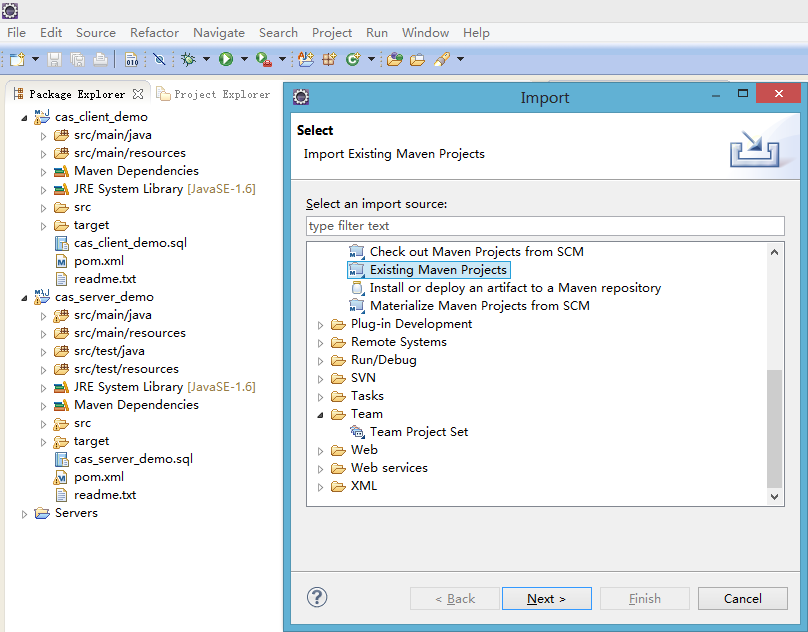 

3.在本地安装MySQL数据库后，通过cas_server_demp.sql和cas_client_demo.sql导入两张表:
在MySQL WorkBench中使用Server->Data Import

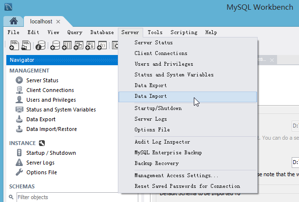 

选择Import from Self-Contained File:

 

点击Start Import后开始导入。
同样的方法导入cas_server_demo.sql

4.在Eclipse里修改相关的配置文件，主要是数据库用户名密码配置
Cas_server_demo项目中修改 /cas_server_demo/src/main/webapp/WEB-INF/database.xml

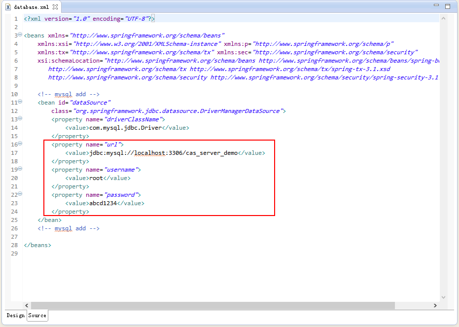 

Cas_client_demo项目中修改 /cas_client_demo/src/main/resources/config/jdbc.properties

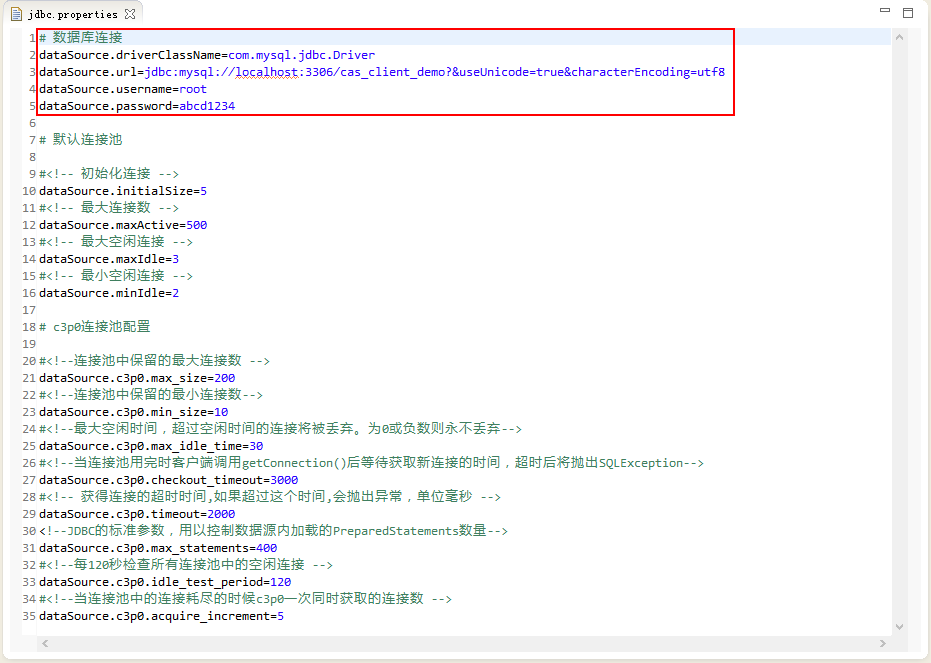 

5.推荐使用Eclipse的WTP插件（Web Tools Platform）来运行Tomcat。由于项目采用的是Maven方式管理，还需要安装m2e-wtp，安装过程参见 http://www.eclipse.org/m2e-wtp/

6.在Eclipse里创建一个Tomcat Server实例，修改Tomcat的配置文件，使其支持https访问：

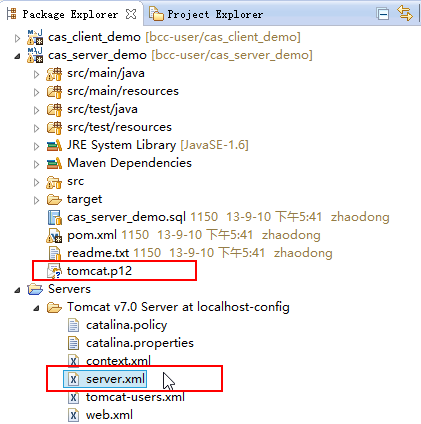 

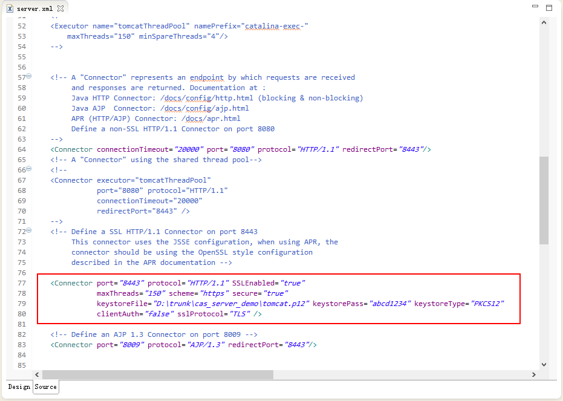 

7.添加运行上述两个项目，点击启动Tomcat

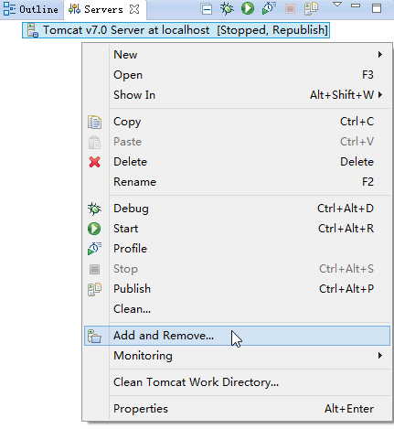 

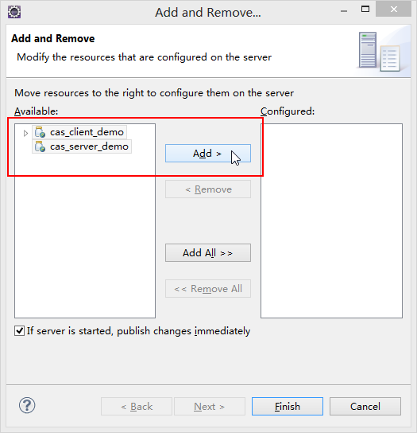 

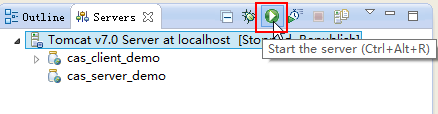 

8.运行Tomcat后检查Console View中是否有异常或错误。
如果一切正常，会显示

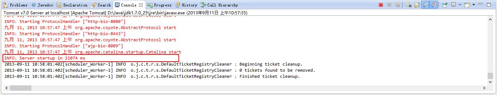 

9.在浏览器访问 http://localhost:8080/app

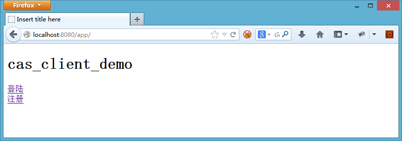

点击注册，会跳入cas界面进行注册。
这里的基本原理是：cas_client_demo只接收cas的用户进行登陆。所以新用户进来必须是cas用户，否则就会跳转到cas注册界面。Cas用户第一次登陆app时候会进入app的资料初始化界面进行相关app属性的设置。设置完毕后可以进行正常的应用访问流程。

输入注册的用户名，密码，点击Submit

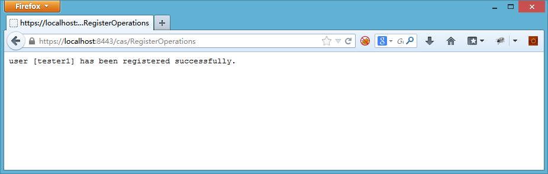

10.重新访问 http://localhost:8080/app
点击登录，会重定向到cas进行单点登陆

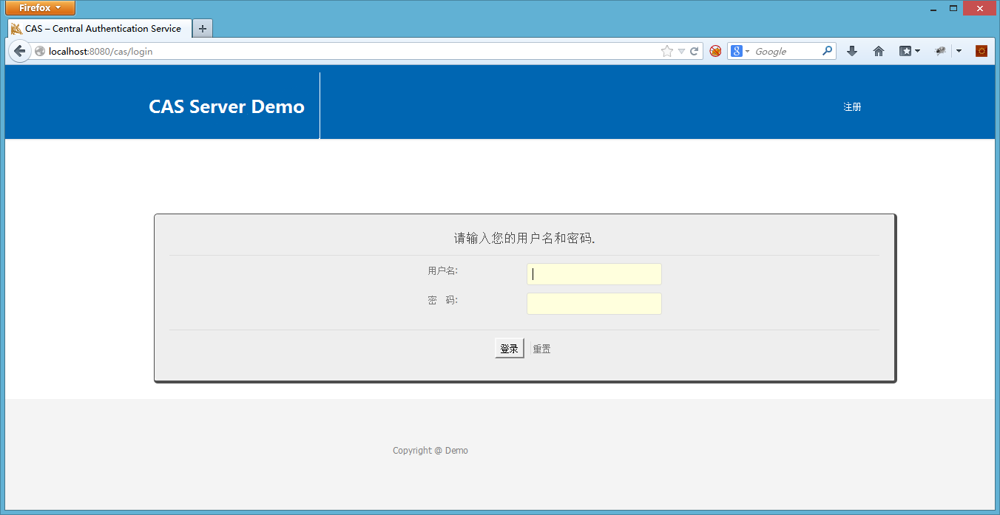

点击Login，登陆成功后返回app，app会检测到该用户是首次登陆本系统，需要完善用户信息。输入相关信息，点击提交

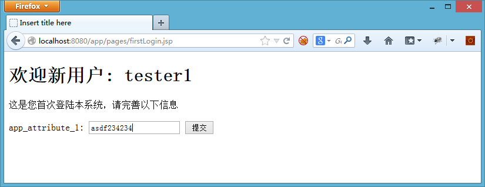

进入真正的应用界面。可以看到相关的身份信息显示。点击logout后就会退出系统。至此，整个系统的注册和登陆流程测试完毕。

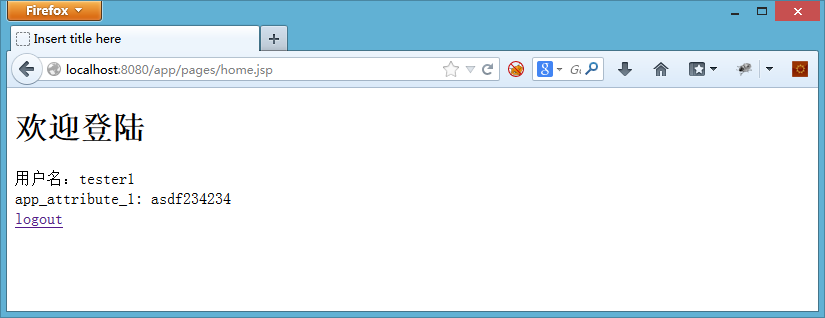
