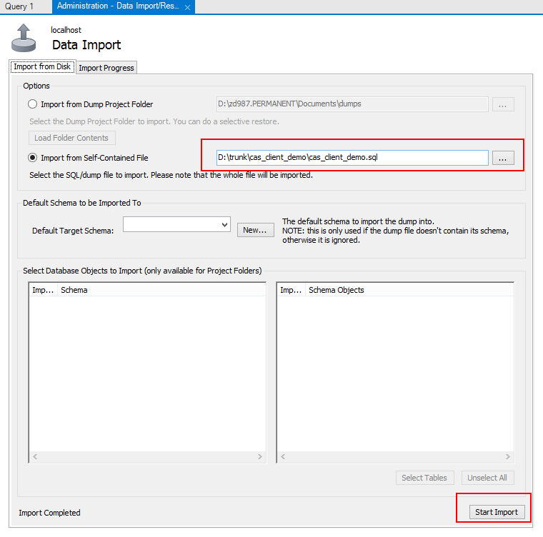
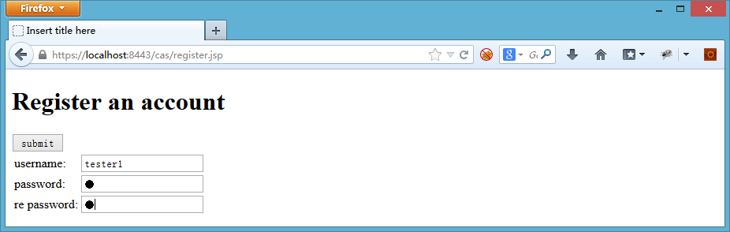

CAS_Demo
========

Single Sign On CAS Demo


快速开始
--
1.
在GitHub上导出两个项目
* cas_client_demo
* cas_server_demo

这两个项目一个作为cas本地服务器端，一个作为本地客户端，可以方便在本地快速部署开发环境。

2.在eclipse中导入这两个项目，通过Import Existing Maven Project方式：

 

3.在本地安装MySQL数据库后，通过cas_server_demp.sql和cas_client_demo.sql导入两张表:
在MySQL WorkBench中使用Server->Data Import

 

选择Import from Self-Contained File:

 

点击Start Import后开始导入。
同样的方法导入cas_server_demo.sql

4.在Eclipse里修改相关的配置文件，主要是数据库用户名密码配置
Cas_server_demo项目中修改 /cas_server_demo/src/main/webapp/WEB-INF/database.xml

 

Cas_client_demo项目中修改 /cas_client_demo/src/main/resources/config/jdbc.properties

 

5.推荐使用Eclipse的WTP插件（Web Tools Platform）来运行Tomcat。由于项目采用的是Maven方式管理，还需要安装m2e-wtp，安装过程参见 http://www.eclipse.org/m2e-wtp/

6.在Eclipse里创建一个Tomcat Server实例，修改Tomcat的配置文件，使其支持https访问：

 

 

7.添加运行上述两个项目，点击启动Tomcat

 

 

 

8.运行Tomcat后检查Console View中是否有异常或错误。
如果一切正常，会显示

 

9.在浏览器访问 http://localhost:8080/app


点击注册，会跳入cas界面进行注册。
这里的基本原理是：cas_client_demo只接收cas的用户进行登陆。所以新用户进来必须是cas用户，否则就会跳转到cas注册界面。Cas用户第一次登陆app时候会进入app的资料初始化界面进行相关app属性的设置。设置完毕后可以进行正常的应用访问流程。



输入注册的用户名，密码，点击Submit


10.重新访问 http://localhost:8080/app
点击登录，会重定向到cas进行单点登陆


点击Login，登陆成功后返回app，app会检测到该用户是首次登陆本系统，需要完善用户信息。输入相关信息，点击提交


进入真正的应用界面。可以看到相关的身份信息显示。点击logout后就会退出系统。至此，整个系统的注册和登陆流程测试完毕。


开发注意事项
--
1.Cas_server_demo这部分不需要关注，只要求可以正确运行即可。我们这里主要关注cas_client_demo的开发工作。

2.首先关注pom.xml文件，需要添加

```xml
<!-- cas client add -->
<dependency>
    <groupId>org.jasig.cas.client</groupId>
	<artifactId>cas-client-core</artifactId>
	<version>3.2.1</version>
	<exclusions>
		<exclusion>
			<groupId>javax.servlet</groupId>
			<artifactId>servlet-api</artifactId>
		</exclusion>
	</exclusions>
</dependency>
<!-- cas client add -->
```

3.接下来是web.xml文件，主要是添加cas相关的Listener，Filter和FilterMapping。

```xml
<!-- cas add -->
<listener>
    <listener-class>org.jasig.cas.client.session.SingleSignOutHttpSessionListener</listener-class>
</listener>

<!-- Start cas filter -->
<filter>
	<filter-name>CAS Single Sign Out Filter</filter-name>
	<filter-class>org.jasig.cas.client.session.SingleSignOutFilter</filter-class>
</filter>

<filter>
	<filter-name>CAS Authentication Filter</filter-name>
	<filter-class>org.jasig.cas.client.authentication.AuthenticationFilter</filter-class>
	<init-param>
		<param-name>casServerLoginUrl</param-name>
		<param-value>https://localhost:8443/cas/login</param-value>
	</init-param>
	<init-param>
		<param-name>serverName</param-name>
		<param-value>http://localhost:8080</param-value>  <!-- 注意：此处更新之后要替换为本地容器对应的端口 -->
	</init-param>
	<init-param>
		<param-name>renew</param-name>
		<param-value>false</param-value>
	</init-param>
	<init-param>
		<param-name>gateway</param-name>
		<param-value>false</param-value>
	</init-param>
</filter>

<filter>
	<filter-name>CAS Validation Filter</filter-name>
	<filter-class>org.jasig.cas.client.validation.Cas10TicketValidationFilter</filter-class>
	<init-param>
		<param-name>casServerUrlPrefix</param-name>
		<param-value>http://localhost:8080/cas</param-value>
	</init-param>
	<init-param>
		<param-name>serverName</param-name>
		<param-value>http://localhost:8080</param-value>  <!-- 注意：此处更新之后要替换为本地容器对应的端口 -->
	</init-param>
</filter>

<filter>
	<filter-name>CAS HttpServletRequest Wrapper Filter</filter-name>
	<filter-class>org.jasig.cas.client.util.HttpServletRequestWrapperFilter</filter-class>
</filter>

<filter>
	<filter-name>CAS Assertion Thread Local Filter</filter-name>
	<filter-class>org.jasig.cas.client.util.AssertionThreadLocalFilter</filter-class>
</filter>
<!-- End cas filter -->

<!-- Start cas filter-mapping -->
<filter-mapping>
	<filter-name>CAS Single Sign Out Filter</filter-name>
	<url-pattern>/pages/*</url-pattern>
</filter-mapping>
<filter-mapping>
	<filter-name>CAS Single Sign Out Filter</filter-name>
	<url-pattern>*.action</url-pattern>
</filter-mapping>

<filter-mapping>
	<filter-name>CAS Authentication Filter</filter-name>
	<url-pattern>/pages/*</url-pattern>
</filter-mapping>
<filter-mapping>
	<filter-name>CAS Authentication Filter</filter-name>
	<url-pattern>*.action</url-pattern>
</filter-mapping>

<filter-mapping>
	<filter-name>CAS Validation Filter</filter-name>
	<url-pattern>/pages/*</url-pattern>
</filter-mapping>
<filter-mapping>
	<filter-name>CAS Validation Filter</filter-name>
	<url-pattern>*.action</url-pattern>
</filter-mapping>

<filter-mapping>
	<filter-name>CAS HttpServletRequest Wrapper Filter</filter-name>
	<url-pattern>/pages/*</url-pattern>
</filter-mapping>
<filter-mapping>
	<filter-name>CAS HttpServletRequest Wrapper Filter</filter-name>
	<url-pattern>*.action</url-pattern>
</filter-mapping>

<filter-mapping>
	<filter-name>CAS Assertion Thread Local Filter</filter-name>
	<url-pattern>/pages/*</url-pattern>
</filter-mapping>
<filter-mapping>
	<filter-name>CAS Assertion Thread Local Filter</filter-name>
	<url-pattern>*.action</url-pattern>
</filter-mapping>
<!-- End cas filter-mapping -->
<!-- cas add -->

<filter>
	<filter-name>identity</filter-name>
	<filter-class>com.bcc.rnd.user.common.IdentityInfoFilter</filter-class>
</filter>
<filter-mapping>
	<filter-name>identity</filter-name>
	<url-pattern>/pages/*</url-pattern>
</filter-mapping>
<filter-mapping>
	<filter-name>identity</filter-name>
	<url-pattern>*.action</url-pattern>
</filter-mapping>
```

4.然后实现一个com.bcc.rnd.user.common.IdentityInfoFilter，这个filter主要是在用户登陆时候判断是否是首次登陆，如果是首次登陆则需要进入资料完善界面。否则从数据库中获取用户资料，存入session。
